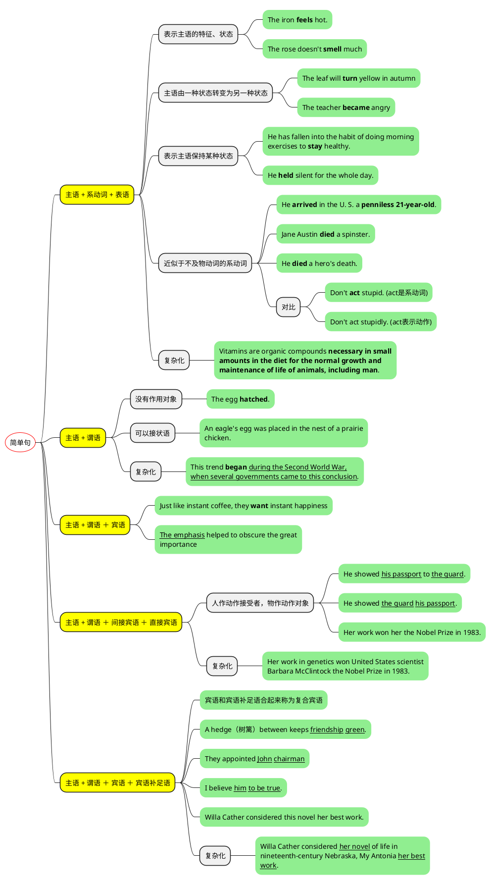

# 简单句

```plantuml
@startmindmap
<style>
rootNode {
    LineStyle 0;
    LineColor red
    BackgroundColor white
    LineThickness 1.0
    RoundCorner 100
    Shadowing 0.0
}
leafNode{
   MaximumWidth 350
   backGroundColor lightgreen
   lineColor transparent
}
:depth(1){
   backGroundColor yellow
}
</style>
+ 简单句
++ 主语 + 系动词 + 表语
+++ 表示主语的特征、状态
++++ The iron **feels** hot.
++++ The rose doesn't **smell** much
+++ 主语由一种状态转变为另一种状态
++++ The leaf will **turn** yellow in autumn
++++ The teacher **became** angry
+++ 表示主语保持某种状态
++++ He has fallen into the habit of doing morning exercises to **stay** healthy.
++++ He **held** silent for the whole day.
+++ 近似于不及物动词的系动词
++++ He **arrived** in the U. S. a **penniless 21-year-old**.
++++ Jane Austin **died** a spinster.
++++ He **died** a hero's death.
++++ 对比
+++++ Don't **act** stupid. (act是系动词)
+++++ Don't act stupidly. (act表示动作)
+++ 复杂化
++++ Vitamins are organic compounds **necessary in small amounts in the diet for the normal growth and maintenance of life of animals, including man**.
++ 主语 + 谓语
+++ 没有作用对象
++++ The egg **hatched**.
+++ 可以接状语
++++ An eagle's egg was placed in the nest of a prairie chicken.
+++ 复杂化
++++ This trend **began** __during the Second World War, when several governments came to this conclusion__.
++ 主语 + 谓语 ＋ 宾语
+++ Just like instant coffee, they **want** instant happiness
+++ __The emphasis__ helped to obscure the great importance
++ 主语 + 谓语 ＋ 间接宾语 ＋ 直接宾语
+++ 人作动作接受者，物作动作对象
++++ He showed __his passport__ to __the guard__.
++++ He showed __the guard__ __his passport__.
++++ Her work won her the Nobel Prize in 1983.
+++ 复杂化
++++ Her work in genetics won United States scientist Barbara McClintock the Nobel Prize in 1983.
++ 主语 + 谓语 ＋ 宾语 ＋ 宾语补足语
+++ 宾语和宾语补足语合起来称为复合宾语
+++ A hedge（树篱）between keeps __friendship__ __green__.
+++ They appointed __John__ __chairman__
+++ I believe __him__ __to be true__.
+++  Willa Cather considered this novel her best work.
+++ 复杂化
++++ Willa Cather considered __her novel__ of life in nineteenth-century Nebraska, My Antonia __her best work__.
@endmindmap
```
1. 系动词 
   这些动词并没有具体的动作，而只是起连接主语和后面成分的作用这种动词后面所接的成分是用来说明主语的特点，表明主语的性质特征的，因此被称之为主语补足语或表语（能表示主语特征的成分）
