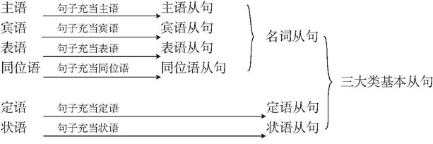
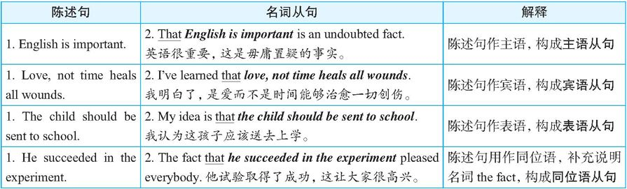
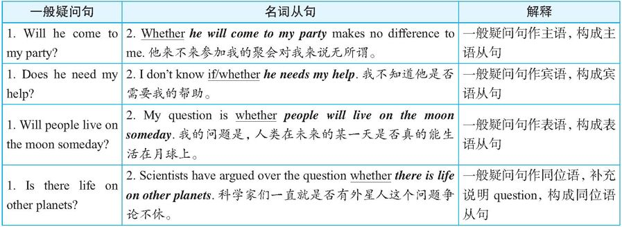
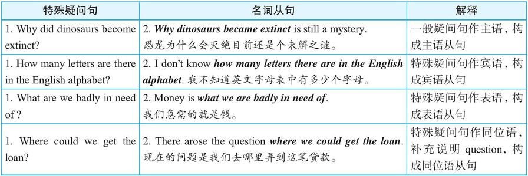

# 复合句

英语的**五种**句型结构是构成英语复杂难句的基础。换句话说，英文中各种复杂的难句都是由这五种基本句型通过扩展、组合、省略、倒装等各种形式的变化得来的
一个句子除了有主语和谓语之外，其他可能包含的成分还有*宾语、表语、定语、状语、补语和同位语*等。在这些成分中，**谓语较为特殊**，只能由**动词**来充当，而其他成分则可以由词、短语或者句子来充当

## 名词从句

相当于名词作用的句子有三类：陈述句、一般疑问句以及特殊疑问句。
因此，名词从句可简单概括为这样一句话：**名词从句就是用三种句子来分别充当另外一个句子的四种句子成分**，这构成了名词从句的本质特征。
但是，值得注意的是，**这三种句子不是直接放在另一个句子中作成分**，而是要作各种变化调整

### 陈述句作句子成分

要在陈述句句首加上that, 作宾语从句时某些情况可以省略 that

#### 例子分析

>He said no word at the meeting was strange.

对于这个句子，很多读者自然会作宾语从句理解：
>He said <strong>that</strong> no word at the meeting was strange.

此时句子的意思是：他说，会上人们的发言都很正常，并没有什么奇怪的。
但是，如果在句首添加一个that而将其改写为：
><strong>That</strong> he said no word at the meeting was strange.

此时则要理解成：他在会上一言不发，这真让人觉得有些蹊跷。

### 一般疑问句作句子成分

当把一个一般疑问句（见下表中的各例句1）当作名词来使用时，需要先将疑问句的<strong>倒装语序变成陈述句语序</strong>，并在句首加上<strong>whether或if（*if只用在宾语从句中*）</strong>来引导，以保留原句的疑问意义。然后，把“whether＋陈述句”这一结构分别充当另一个句子的主语、宾语、表语或同位语等四种成分

#### 例子分析

>1) I don't know if or not he comes.
>2) I don't know whether or not he comes.

例句1错误，因为if和or not不能连用，即不能说成if or not。

例句2）正确。
>The question is if he will come

这个句子不妥，应改为The question is whether he will come. 这里是表语从句，应由whether引导。

### 特殊疑问句作句子成分

当把一个特殊疑问句（见下表中的各例句1）当作名词来使用时，需要先将疑问句的倒装语序变成陈述句语序，然后分别充当另一个句子的主语、宾语、表语或同位语等四种成分

