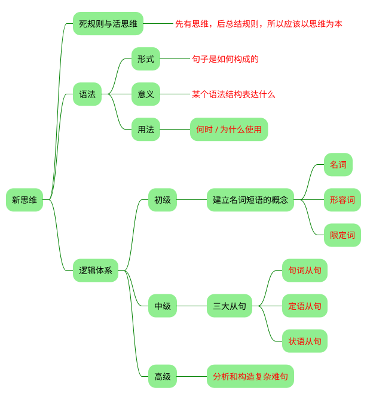
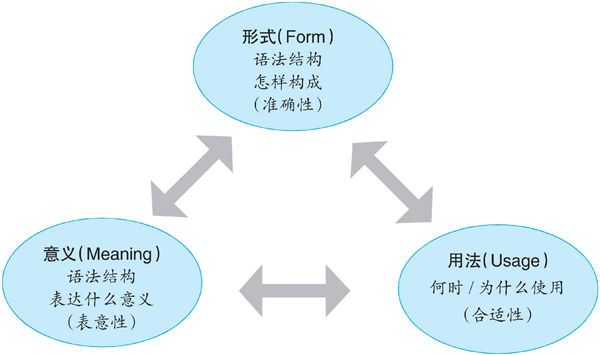

```plantuml
@startmindmap
<style>
node{
    BackgroundColor lightGreen
    LineColor transparent
}
leafNode{
    FontColor red
}
arrow{
    LineColor green
}
</style>
+ 新思维
++ 死规则与活思维
+++_ 先有思维，后总结规则，所以应该以思维为本
++ 语法
+++ 形式
++++_ 句子是如何构成的
+++ 意义
++++_ 某个语法结构表达什么
+++ 用法
++++ 何时 / 为什么使用
++ 逻辑体系
+++ 初级
++++ 建立名词短语的概念
***** 名词
***** 形容词
***** 限定词
+++ 中级
++++ 三大从句
+++++ 句词从句
+++++ 定语从句
+++++ 状语从句
+++ 高级
++++ 分析和构造复杂难句
@endmindmap
```

### 三者关系

### 英汉思维区别
- 英文有“状态”和“动作”的区别