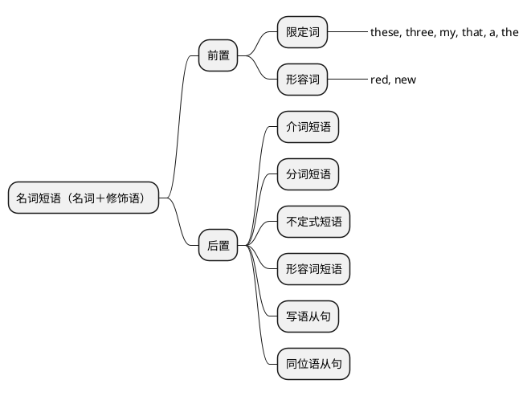
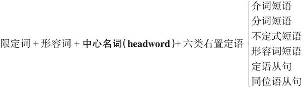
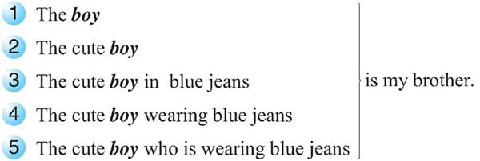

```plantuml
@startmindmap
+ 名词短语（名词＋修饰语）
++ 前置
+++ 限定词
++++_ these, three, my, that, a, the
+++ 形容词
++++_ red, new
++ 后置
+++ 介词短语
+++ 分词短语
+++ 不定式短语
+++ 形容词短语
+++ 写语从句
+++ 同位语从句
@endmindmap
```
- 公式（左二右六）

- 实例

# 重要概念
- 只有名词才有定语，定语用于修饰名词