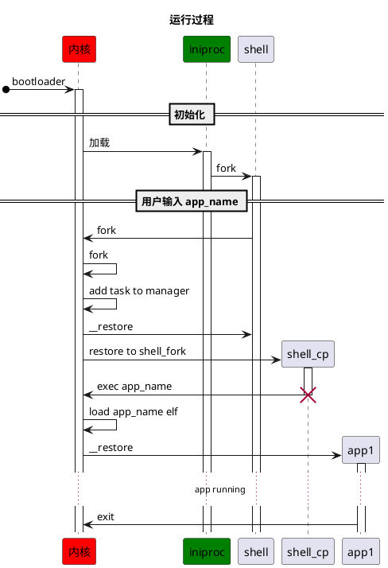

```plantuml
@startuml
title 运行过程

participant 内核 as core #red
participant iniproc as init #green
participant shell

[o-> core: bootloader
== 初始化 ==
activate core
core -> init ++: 加载
init -> shell: fork
activate shell
== 用户输入 app_name ==
shell -> core: fork
core -> core: fork
core -> core: add task to manager
core -> shell: __restore
create shell_cp
core -> shell_cp ++: restore to shell_fork
shell_cp -> core: exec app_name
destroy shell_cp
core -> core: load app_name elf
create app1
core -> app1 ++: __restore
... app running ...
app1 -> core: exit
@enduml
```