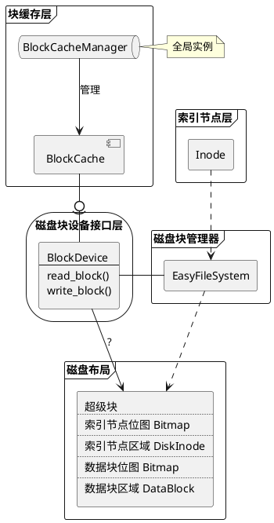
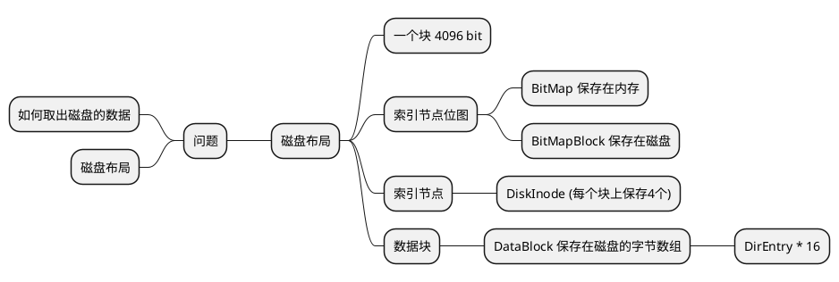

```plantuml
@startuml
' skinparam componentStyle rectangle

frame "索引节点层"{
    rectangle Inode
}

frame "磁盘块管理器"{
    rectangle EasyFileSystem
}

frame "磁盘布局"{
rectangle SuperBlock[
超级块
....
索引节点位图 Bitmap
....
索引节点区域 DiskInode
....
数据块位图 Bitmap
....
数据块区域 DataBlock
]
}

frame "块缓存层"{
component BlockCache
queue BlockCacheManager
BlockCacheManager --> [BlockCache]: 管理
}

note right of BlockCacheManager: 全局实例
storage "磁盘块设备接口层"{
rectangle BlockDevice [
BlockDevice
----
read_block()
write_block()
]
}

Inode ..> EasyFileSystem
EasyFileSystem ..> SuperBlock
EasyFileSystem - BlockDevice
BlockCache -0)- BlockDevice
BlockDevice -> SuperBlock: ? 

@enduml
```

```plantuml
@startmindmap
+ 磁盘布局
++ 一个块 4096 bit
++ 索引节点位图
+++ BitMap 保存在内存
+++ BitMapBlock 保存在磁盘
++ 索引节点
+++ DiskInode (每个块上保存4个)
++ 数据块
+++ DataBlock 保存在磁盘的字节数组
++++ DirEntry * 16
-- 问题
--- 如何取出磁盘的数据
--- 磁盘布局
@endmindmap
```
