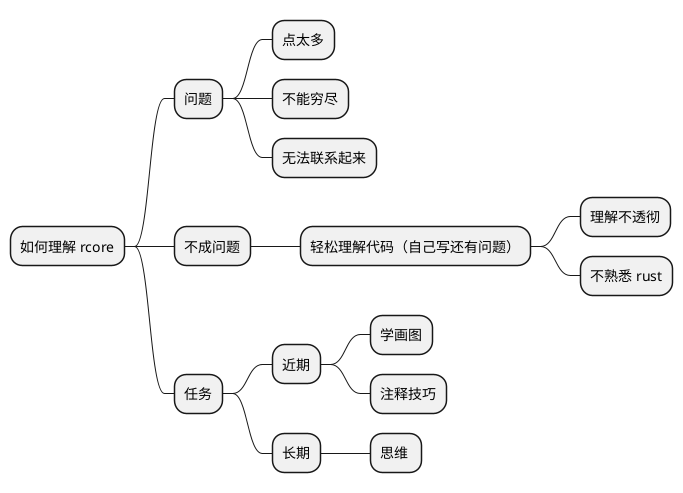
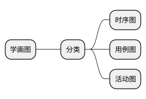

现在学第七章，意识到之前的学习方法出现了问题，已经到了难以为继的地步，虽然现在时间紧迫，但必须要作出一些改变，提高效率，否则损失更大。
下面是现在暂时想到的问题和要改变的地方。

```plantuml
@startmindmap
+ 如何理解 rcore
++ 问题
+++ 点太多
+++ 不能穷尽
+++ 无法联系起来
++ 不成问题
+++ 轻松理解代码（自己写还有问题）
++++ 理解不透彻
++++ 不熟悉 rust
++ 任务
+++ 近期
++++ 学画图
++++ 注释技巧
+++ 长期
++++ 思维 
@endmindmap
```

# 学画图

```plantuml
@startmindmap
+ 学画图
++ 分类
+++ 时序图
+++ 用例图
+++ 活动图
@endmindmap
```